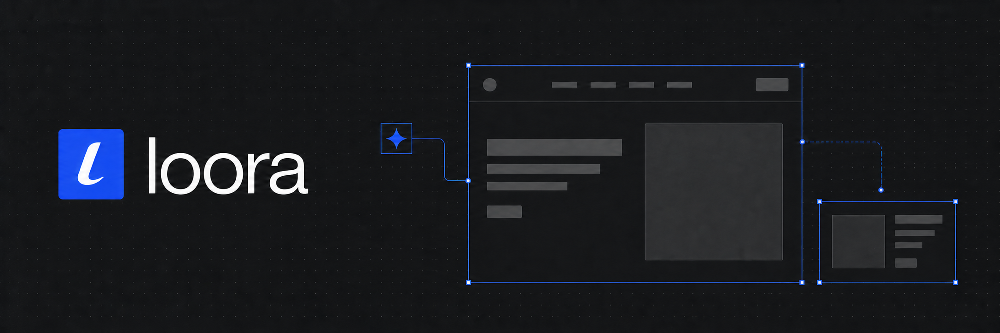

# Loora

A canvas design tool your agent can edit. Arrange structured UI nodes on the canvas; connect Claude, Codex, Cursor, or opencode over MCP and it works on the same document. Branches, version history, and one-way export to HTML, React/TSX, JSON, and PNG.

Bun · TanStack Start · Drizzle + Neon · Better Auth · Polar · oRPC.

## Design guide skill

Teaches an agent how to use the canvas tools well. Add `-g` to install it for every project.

```bash
npx skills add https://github.com/lassejlv/loora/tree/main/skills/loora-design-guide
```

## Monorepo layout

- `apps/web` — the TanStack Start app (routes, API handlers, editor shell)
- `crates/mcp-server` — the Rust MCP transport (`mcp.loora.design`)
- `crates/ws-server` — the Rust realtime service (`ws.loora.design`)
- `apps/desktop` — the Tauri desktop app over a Vite build of the same interface
- `packages/canvas` — document model, engine, merge, renderer, import, export
- `packages/editor` — the editor shell, panels, and client sync
- `packages/shell` — dashboard, settings, and the signed-in gates, shared by web and desktop
- `packages/platform` — which client this is, and where its API and links point
- `packages/ui` — shared design-system primitives and design tokens
- `packages/agent` — the shared canvas tool vocabulary for MCP and handoff
- `packages/rpc` — the oRPC router, storage, handoff tokens, version history
- `packages/db` — Drizzle schema, Neon client, migrations
- `packages/auth` — Better Auth, preview access, GitHub
- `packages/billing` — Polar plans and entitlements
- `packages/realtime` — wire protocol, connection tickets, ingest client

## License

Copyright (C) 2026 Lasse Vestergaard

Loora is free software: you can redistribute it and/or modify it under the
terms of the **GNU Affero General Public License** as published by the Free
Software Foundation, either version 3 of the License, or (at your option) any
later version.

See [LICENSE](./LICENSE) for the full license text.

You may fork, modify, and self-host Loora (including for business use). If you
modify the software and provide it to users over a network, AGPL-3.0 requires
you to offer the corresponding source to those users under the same license.
